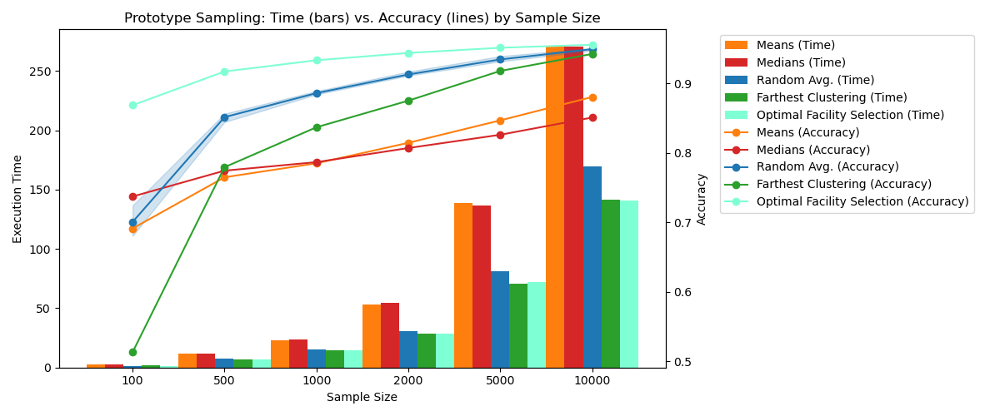

# Prototype selection algorithms for K-Nearest Neighbors

Nearest Neighbor (1-NN) classification is a simple yet effective approach for many machine learning tasks, but its computational cost becomes prohibitive for large datasets such as MNIST. To mitigate this issue, prototype selection methods aim to reduce the dataset size while preserving classification performance. This report evaluates multiple prototype selection strategies, including random sampling, similarity-based selection using mean and median, farthest-point clustering, and optimal facility location. We compare these methods in terms of classification accuracy and execution time, highlighting the trade-offs between efficiency and performance. Among all methods, optimal facility location consistently achieves the best classification accuracy, even with a reduced number of prototypes, demonstrating its effectiveness in preserving the structure of the dataset. We also discuss several directions for future improvements, including exploring alternative distance metrics, optimizing facility location through parallelization and approximation techniques, and integrating dimensionality reduction methods to enhance efficiency.

Figure shows a comparison of the performance of various prototype sampling strategies measured across different
sample sizes. The results shown for random sampling are averages calculated over 5 iterations. The random sampling
accuracy is charted in a min-max range. The execution times shown are prediction times, and not sampling times,
since sampling times can vastly vary for different strategies. We see that Optimal Facility Location strategy performs
exceedingly well in comparison to the other sampling strategies showing minimal deterioration in performance even
as the sample size is scaled down significantly.

Accuracy comparison of prototype selection methods

| **Method**                   | **100** | **500** | **1000** | **2000** | **5000** | **10000** |
|-----------------------------|--------:|--------:|---------:|---------:|---------:|----------:|
| Random Sampling             |  70.04  |  85.13  |   88.59  |   91.28  |   93.44  |    94.93  |
| Similarity (Mean)           |  69.11  |  76.48  |   78.49  |   81.44  |   84.67  |    88.03  |
| Similarity (Median)         |  73.71  |  77.42  |   78.66  |   80.69  |   82.60  |    85.08  |
| Farthest Point Clustering   |  51.30  |  77.92  |   83.67  |   87.51  |   91.79  |    94.24  |
| **Optimal Facility Selection** | **86.86** | **91.71** | **93.33** | **94.38** | **95.13** | **95.56** |
